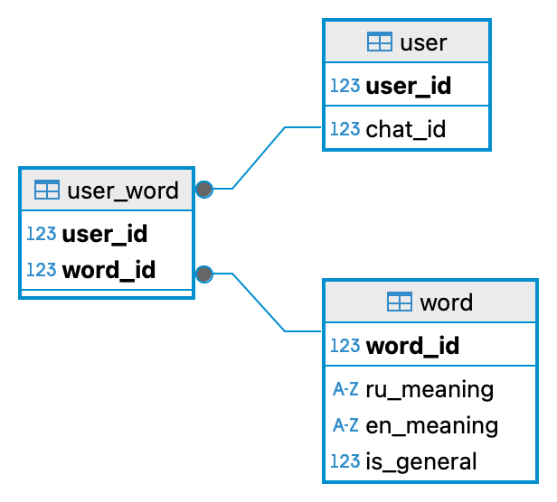

# Учите английский с помощью бота

## Инструкция пользователя
1. Запустите бот с помощью команды __/start__, появится приветсвенно сообщение
2. Отгадывайте слова
3. Если хотите добавить слово для изучения, выберите "Добавить слово", затем напишите слово по-русски и после пробела по-английски и отправьте сообщение. Слово добавится только для текущего чата и вы увидите число изучаемых слов
4. Если хотите удалить слово, выберите "Удалить слово", затем напишите слово по-русски и отправьте сообщение
5. Если хотие пропустить слово, выберите "Пропустить слово"

_Примечание: на данный момент можно добавлять только слова, но не словосочетания_\
_Примечание: при удалении слова для пользователя слово не будет показываться для пользователя, но оно остаётся в базе_

## Инструкция по запуску бота

Заполните файл конфигурации
```
DSN='postgresql+pg8000://<user>:<password>@<host>:<port>/<database>'
TOKEN=<token>
REMOVE_TABLES=1
CREATE_DB=1
FILL_DATE=1
DATA_FILE_PATH='./data/data.json'
```
1. Для DSN укажите пользователя, пароль, хост, пост и базу данных
2. Укажите токен
3. Опции REMOVE_TABLES, CREATE_DB и FILL_DATE отвечают за создание и заполнение базы. При тестировании можно оставить все значения отмеченными Если требуется, чтобы база не создавалась заново при каждом запуске, то эти значения надо заменить на 0
4. В DATA_FILE_PATH указан путь к данным для заполения базы общими для пользователей изучаемыми словами

## Диаграмма базы данных
